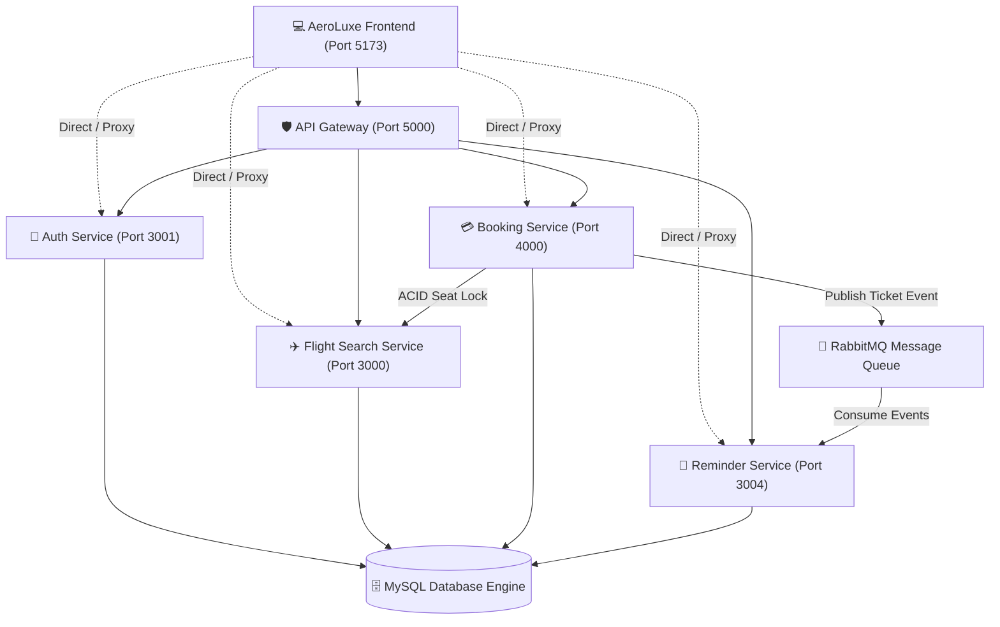

# ✈️ AeroLuxe | Next-Gen Airline & Flight Reservation Platform

A beautiful, aesthetic, and production-grade full-stack Airline Reservation System featuring a luxury modern Frontend connected to a distributed Node.js/Express Microservices architecture.

---

## 🌟 Frontend Features & Highlights

The frontend is crafted with a high-end luxury aesthetic (**Deep Midnight Navy `#070b14`**, **Electric Cyan `#38a8f8`**, and **Imperial Gold `#f59e0b`** accents) with smooth glassmorphism, responsive micro-interactions, and instant feedback.

1. **✈️ Interactive Flight Search & Discovery**:
   - One-Way & Round-Trip flight search engine.
   - Interactive Airport selection with city autocomplete and IATA codes (`DEL`, `BOM`, `BLR`, `DXB`, `LHR`, `JFK`, `SIN`, `HND`, `CDG`).
   - Real-time filters: Price slider, airline carriers, direct/non-stop options, and multi-mode sorting.
2. **💺 3D-Styled Aircraft Cabin Seat Map**:
   - Visual aircraft fuselage layout with First Class Suites, Business Class Lie-Flat pods, and Economy Comfort.
   - Live seat selection counter, occupied seat states, and tier pricing calculations.
3. **💳 End-to-End Booking & Checkout**:
   - Multi-step booking modal: Passenger details, dietary meal selection, travel insurance, and priority boarding add-ons.
   - Payment Gateway simulation (Cards, UPI / QR Code, Apple/Google Pay) with **Idempotency Key** generation.
   - Canvas Confetti celebration and instant PNR generation.
4. **🎫 Luxury Digital Boarding Pass**:
   - Perforated dual-section boarding pass with high-resolution QR codes, gate information, seat numbers, and one-click printing.
5. **📡 Live Flight Radar & Gate Status Tracker**:
   - Search flights by flight number or destination with real-time telemetry (On-Time, Boarding, Departed, Landed, Gates & Baggage Belts).
6. **🔔 Email Departure Alerts (Reminder Microservice)**:
   - Schedule email notifications for flight departures and price alerts via the Reminder Service queue.
7. **🛡️ Airline Operations Admin Portal**:
   - Manage flight schedules, add airports, register cities, and update airplane fleet models.
   - Real-time Microservice Mesh latency and health monitoring.

---

## 🏗️ Backend Microservices Architecture



### Microservice Directory & Ports:

| Service | Port | Description & Key Responsibilities |
|---|---|---|
| **API Gateway** | `5000` | Unified reverse proxy, rate limiting, and centralized auth validation. |
| **Auth Service** | `3001` | User registration, login, bcrypt password hashing, and JWT token issuing. |
| **Flight Search Service** | `3000` | Airplanes, airports, cities catalog, and flight inventory search with filters. |
| **Flight Booking Service** | `4000` | ACID transaction booking, seat decrement/increment, and payment processing with idempotency keys. |
| **Reminder Service** | `3004` | RabbitMQ ticket event consumer and scheduled cron email dispatcher. |
| **AeroLuxe Frontend** | `5173` | Modern luxury React + Vite + Tailwind CSS Single Page Application. |

---

## 🚀 Quick Start Guide

### 1. Launch the Frontend:
```bash
npm run frontend
# Or navigate to the frontend directory:
cd frontend
npm run dev
```
Open **[http://localhost:5173](http://localhost:5173)** in your browser.

### 2. Launch Backend Microservices (Optional / As Needed):
```bash
npm run gateway     # Starts API Gateway on Port 5000
npm run auth        # Starts Auth Service on Port 3001
npm run flights     # Starts Flight Search Service on Port 3000
npm run bookings    # Starts Booking Service on Port 4000
npm run reminders   # Starts Reminder Service on Port 3004
```

> **Note on Resilient Architecture:** The frontend includes an automatic hybrid fallback and seed data engine. Even if individual microservices or local MySQL databases are offline or initializing, every frontend feature (booking, search, seat map, boarding pass, flight status tracker, admin panel) remains 100% interactive, responsive, and testable right away!
